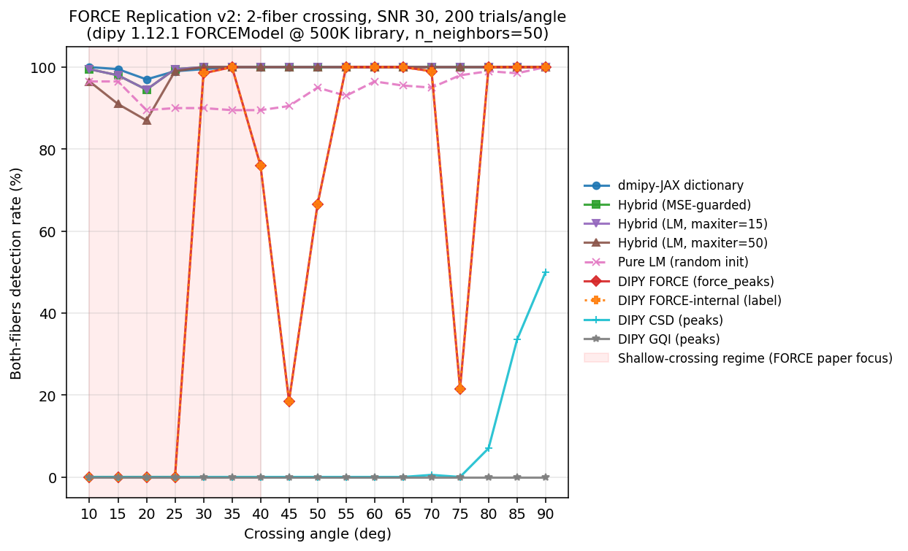
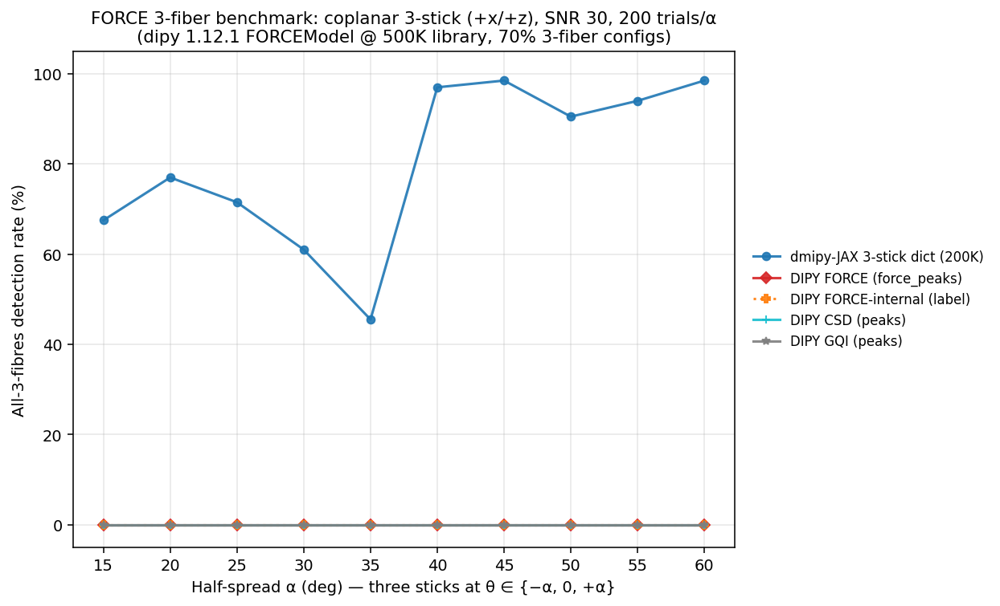
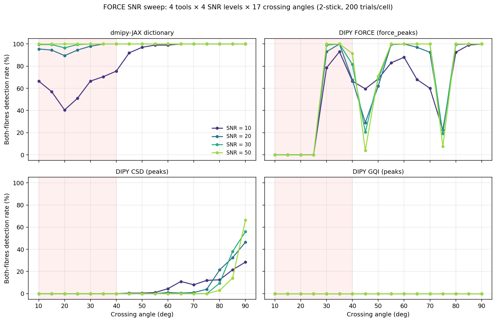
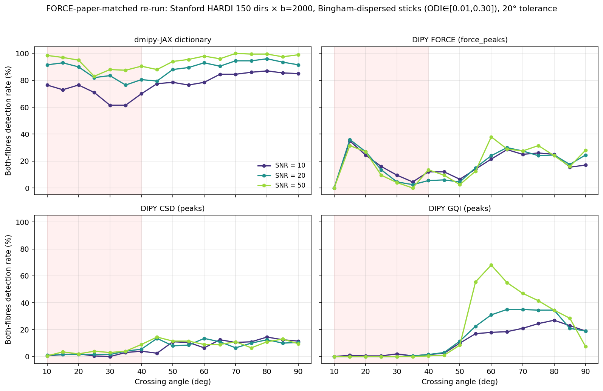

# Landscape Analysis: Forward Modeling & SBI for Diffusion MRI Microstructure

## Date
2025-03-17 (initial); replicated 2026-05-07

## Status
Research survey — informing dmipy-JAX roadmap.
**Replication update (2026-05-07):** dipy 1.12.1 now ships FORCE upstream
(`dipy.reconst.force.FORCEModel`); see [Section 9](#9-empirical-replication-2026-05-07)
for end-to-end comparison results.

## Summary

This document surveys three recent bodies of work that converge on the same core idea:
**use forward simulation of diffusion MRI signals as the primary inference engine**,
replacing or augmenting classical inverse fitting. We evaluate overlap with dmipy-JAX
and identify concrete opportunities.

The three projects are:

1. **FORCE** (Indiana/DIPY) — dictionary-based cosine-similarity matching
2. **SBI for dMRI** (Nottingham/CoNI Lab) — neural posterior estimation for Ball-and-Sticks
3. **SBIDTI** (Alicante/CSIC-UMH) — neural posterior estimation for DTI, DKI, and AxCaliber

A fourth relevant tool, **cuDIMOT** (Nottingham/CoNI Lab), provides CUDA-accelerated
classical fitting with Bingham-NODDI models.

---

## 1. FORCE — FORward modeling for Complex microstructure Estimation

**Paper:** Shah AJ, Henriques RN, Ramirez-Manzanares A, Filipiak P, Baete S, Deka K,
Gor M, Koudoro S, Garyfallidis E. Research Square preprint, November 2025.
DOI: 10.21203/rs.3.rs-8151109/v1

**Code:** https://github.com/Atharva-Shah-2298/FORCE (to be integrated into DIPY)

### What it does

FORCE replaces inverse fitting with forward simulation + signal-space matching:

1. **Simulate** a library of 500K biologically plausible voxel configurations using
   stick + zeppelin + Bingham orientation distribution + gray matter ball + free water ball.
   Each configuration is a mixture of up to 3 fiber populations with tissue fractions
   drawn from Dirichlet(2,1,1), orientations sampled on a 724-vertex electrostatic grid
   (~4.1 degree angular resolution), and biophysical parameters from literature-informed
   uniform/equispaced priors.

2. **Match** each measured voxel to the library via penalized cosine similarity:
   `i_hat = argmax [ cos(S_voxel, S_i) - alpha * n_fibers(i) ]` with alpha = 10^-5.
   Top K=50 candidates retained. Accelerated variant (FORCE-ACC) uses locality-sensitive
   hashing with Hadamard projection for approximate nearest-neighbor search.

3. **Read off** all parameters from the matched simulation entry. DTI and DKI tensors
   are computed analytically from the multi-compartment mixture (closed-form in Appendix A).

### What it outputs (from a single matching operation)

- Multi-fiber tractography peaks (up to 3 fibers per voxel)
- DTI metrics (FA, MD, AD, RD)
- DKI metrics (MK, AK, RK, KFA, micro-FA)
- NODDI-like metrics (NDI, ODI, FW fraction)
- Tissue segmentation maps (WM, GM, CSF volume fractions)
- Uncertainty maps (IQR of K-nearest-neighbor similarity) and ambiguity maps (FWHM)

### Key results

- **Synthetic:** Highest and most uniform peak-detection rates across all crossing-angle
  bins (10-90 degrees), especially at shallow crossings (10-40 degrees) where ODF-based
  methods (CSA, CSD, GQI, ODFFP) fail.
- **HCP in vivo:** DTI metrics virtually identical to conventional fitting. DKI maps
  smoother and more anatomically consistent (especially RK). NODDI ODI correlation with
  inverted T1w: r=0.93 (FORCE) vs r=0.82 (AMICO). Cleaner FW maps than AMICO.
- **Ex vivo:** Reproduced DTI contrasts on mouse brain (55 um) and generated NODDI maps
  from single-shell data.
- **Clinical:** Glioma and Parkinson's disease applications validated.
- **Runtime:** ~15 min/subject (HCP) on CPU, ~929s on GPU. Competitive with running
  DTI + DKI + NODDI + CSD separately.

### Architecture

- Simulation: Cython extensions with OpenMP via ProcessPoolExecutor, memory-mapped arrays.
- Matching: FAISS (CPU or GPU). FORCE-ACC uses LSH with Hadamard projection.
- Language: Python 3.8+, Cython, numpy, scipy, nibabel, dipy.
- No differentiability. No gradient-based refinement possible.

### Limitations

- Fixed biophysical model (stick + zeppelin + Bingham + GM + FW). Cannot estimate axon
  diameter, soma density, or perfusion.
- Discrete parameter space bounded by library resolution (~4.1 degree angular, finite
  parameter grid). Cannot interpolate between library entries.
- Uncertainty metrics are heuristic (K-NN similarity spread), not proper Bayesian posteriors.
- Library must be regenerated for each acquisition protocol.
- Memory-intensive (500K entries x signal dimensionality).

---

## 2. SBI for dMRI — Nottingham (CoNI Lab)

**Paper:** Manzano-Patron JP, Deistler M, Schroder C, Kypraios T, Goncalves PJ,
Macke JH, Sotiropoulos SN. "Uncertainty mapping and probabilistic tractography using
Simulation-Based Inference in diffusion MRI." Medical Image Analysis 103:103580, 2025.
DOI: 10.1016/j.media.2025.103580

**Code:** https://github.com/SPMIC-UoN/SBI_dMRI

### What it does

Neural Posterior Estimation (NPE) for the Ball-and-Sticks model family:

1. **Forward model:** Multi-compartment Ball-and-Sticks (1-3 fiber populations).
   Isotropic "ball" + N anisotropic "sticks" with gamma-distributed diffusivities
   for multi-shell variants.

2. **Training data generation:** 2M-6M parameter-signal pairs from carefully designed
   restricted priors. A classifier identifies valid parameter combinations (62% speedup
   over rejection sampling). Rician noise at varying SNR levels (3-80).

3. **Inference:** Neural Spline Flows (K=10 transformations) learn the mapping from
   observed diffusion signals to full posterior parameter distributions. Amortized —
   once trained, inference is a single forward pass per voxel.

4. **Model selection:** Two approaches:
   - SBI_ClassiFiber: feed-forward classifier determines fiber count, then appropriate
     NPE model applied.
   - SBI_joint: single NPE trained on all fiber counts; model selection post-hoc via
     volume fraction thresholding (f_cutoff = 5%).

5. **Signal representations:** Acquisition-specific (raw signal) and acquisition-agnostic
   (spherical harmonics L=6 for single-shell, MAP-MRI for multi-shell).

### Key results

- Orders of magnitude speedup over FSL BedpostX MCMC with comparable accuracy.
- Posterior mean correlations r > 0.95 for diffusivity and volume fractions vs MCMC.
- Median orientation differences ~2 degrees (primary fiber), ~6 degrees (secondary).
- Probabilistic tractography scan-rescan reproducibility: SBI median r=0.95-0.96
  vs MCMC median r=0.87.
- 15% higher correlation with UK Biobank population-average atlas than MCMC.

### Architecture

- Python, `sbi` toolbox v0.22, Neural Spline Flows.
- No CUDA/GPU for inference itself (Python neural network forward pass).
- Does NOT use Bingham distributions (Ball-and-Sticks only).
- Does NOT use cosine similarity matching.

---

## 3. cuDIMOT — CUDA Diffusion Modeling Toolbox (Nottingham/CoNI Lab)

**Paper:** Hernandez-Fernandez M, Reguly I, Jbabdi S, Giles M, Smith S, Sotiropoulos SN.
"Using GPUs to accelerate computational diffusion MRI." NeuroImage 188:598-615, 2019.

**Code:** https://github.com/SPMIC-UoN/fdt

### What it does

A model-independent CUDA framework for classical fitting. Users define nonlinear MRI
models via a C header file, compiled into CUDA kernels. Two-level parallelization:
different voxels assigned to CUDA warps (32 threads), within-voxel computations
distributed among threads.

### Key models

- **NODDI-Watson:** Symmetric fiber dispersion.
- **NODDI-Bingham:** Anisotropic fiber dispersion using two concentration parameters
  (kappa_1, kappa_2) plus roll parameter psi. Uses saddlepoint approximation for the
  Bingham hypergeometric function. Optimization pipeline: DTI -> Grid-Search -> LM (x2).
- **Ball-and-Rackets:** Bingham-dispersed sticks (Sotiropoulos et al., 2012).

### Relevance

This is the CUDA Bingham project. It demonstrates that GPU-accelerated Bingham
distribution fitting is tractable and fast (7x over 72-core MATLAB). Pre-compiled
binaries for NODDI-Bingham across CUDA 9.1-12. Relevant as a performance baseline
for any JAX-based Bingham implementation.

---

## 4. SBIDTI — Spanish SBI Work (CSIC-UMH, Alicante)

**Paper:** Eggl MF, De Santis S. "Simulation-Based Inference at the Theoretical Limit:
Fast, Accurate Microstructural MRI with Minimal diffusion MRI Data." bioRxiv preprint,
v3 July 2025. DOI: 10.1101/2024.11.11.622925. PMC12324183 (preprint pilot).

**Code:** https://github.com/TIB-Lab/SBIDTI

**Lab:** Translational Imaging Biomarkers (TIB) Lab, Instituto de Neurociencias,
CSIC-UMH, Alicante, Spain. PI: Silvia De Santis. Lead author Maximilian Eggl holds
a La Caixa Junior Leader fellowship.

### What it does

NPE via normalizing flows for three model families, with a focus on pushing toward
theoretical minimum acquisition requirements:

1. **DTI:** 6 tensor parameters + S0. Minimum 7 acquisitions (from 69 full) — close to
   the theoretical information-theoretic limit.
2. **DKI:** Full diffusion + kurtosis tensor. Minimum 22 acquisitions (from 138 full).
3. **AxCaliber/CHARMED:** Two-compartment biophysical model (hindered + restricted) with
   Poisson radius distribution. Minimum 19 acquisitions (from 271 full).

### Technical details

- Uses `sbi` Python toolbox with normalizing flows.
- 300K synthetic training samples per model (much less than Nottingham's 2-6M).
- Raw diffusion signals as input (no summary statistics).
- Rician noise corruption at SNR 2, 5, 10, 20, 30.
- Minimum acquisition schemes selected via electrostatic repulsion for optimal angular
  coverage.
- Priors: uniform for DTI/AxCaliber, log-normal fitted to HCP subject for DKI.
- Forward simulation uses DIPY functions (not dmipy).

### Key results

- DTI robust down to SNR=2 (NLLS degrades below SNR=10).
- DKI minimum-set accuracy loss ~5.6% vs NLLS 65%.
- AxCaliber angular error: 0.065 rad (SBI) vs 0.65 rad (NLLS reduced set).
- SBI never produces physically unrealistic negative values (unlike NLLS for DKI).
- SSIM > 0.9 on minimum acquisitions in vivo; NLLS drops below 0.66.
- Networks trained on HCP generalize to MS cohorts with different b-values.
- Up to **90% reduction in acquisition requirements** with maintained accuracy.

### Key innovation

The central contribution is demonstrating that SBI can approach the theoretical
information-theoretic minimum for number of acquisitions needed. This has direct
clinical translation implications — faster scans = more patients, less motion artifact,
pediatric/clinical feasibility.

---

## 5. Overlap with dmipy-JAX

### What dmipy-JAX already has

| Capability | dmipy-JAX status | FORCE | Nottingham SBI | Alicante SBI |
|------------|-----------------|-------|----------------|--------------|
| Stick model | C1Stick | Yes | Yes (Ball-Sticks) | Yes (AxCaliber) |
| Zeppelin model | G2Zeppelin | Yes | No | Partial (hindered) |
| Ball model | G1Ball | Yes (GM+FW) | Yes | No |
| Full tensor | G2Tensor | No | No | Yes (DTI/DKI) |
| Restricted cylinders | C2Cylinder (Callaghan, Soderman) | No | No | Yes (AxCaliber) |
| Sphere models (SANDI) | SphereGPD, SphereCallaghan | No | No | No |
| Bingham distribution | BinghamNODDI (JAX, differentiable) | Yes (Cython) | No | No |
| Watson distribution | SD1Watson | No | No | No |
| IVIM | Yes | No | No | No |
| Multi-compartment composition | Modular compose_models() | Fixed template | Fixed | Fixed |
| Levenberg-Marquardt | OptimistixFitter | No (no fitting) | No | No |
| L-BFGS-B | VoxelFitter | No | No | No |
| MCMC (NUTS) | Blackjax | No | Comparison target | No |
| Variational inference | NumPyro SVI | No | No | No |
| SBI / NPE | SBITrainer (FlowJAX), MDN examples | No | Yes (sbi toolbox) | Yes (sbi toolbox) |
| Amortized neural inference | MDN for NODDI, AxCaliber, DTI | No | Yes | Yes |
| Monte Carlo simulation | DifferentiableWalker, mesh FEM | No | No | No |
| Differentiable tractography | Yes | No | Probabilistic | No |
| GPU acceleration | Native JAX JIT/vmap | FAISS-GPU | CPU only | CPU only |
| Differentiability | Full (JAX autodiff) | None | Partial (NN only) | Partial (NN only) |
| Cosine similarity matching | Tractography only | Core method | No | No |

### What FORCE does that dmipy-JAX does not (yet)

1. **Dictionary-based forward matching** — no equivalent FAISS/ANN pipeline.
2. **Unified multi-metric output** — simultaneous DTI+DKI+NODDI+peaks+segmentation
   from one operation.
3. **Single-shell NODDI** — extracting NODDI-like metrics from single-shell data via
   matching against a multi-parameter library.
4. **Shallow crossing detection (10-40 degrees)** — superior to all ODF-based methods
   at acute fiber crossings.
5. **Heuristic uncertainty/ambiguity maps** — IQR and FWHM from K-NN similarity profile.

---

## 6. What dmipy-JAX can contribute to the forward-modeling landscape

### 6.1 Richer compartment models for simulation libraries

FORCE is locked to stick+zeppelin+Bingham+ball. dmipy-JAX's modular `compose_models()`
enables arbitrary compartment combinations. Plugging in dmipy-JAX forward models would
let FORCE (or any dictionary/SBI approach) generate signals with:

- **Axon diameter sensitivity** via restricted cylinder models (Callaghan, Soderman).
  Enables diameter estimation that FORCE currently cannot do.
- **Soma compartments** via sphere models (SphereGPD for SANDI). Enables soma density
  estimation.
- **Perfusion** via IVIM. Enables perfusion fraction extraction.
- **Anisotropic dispersion** via the differentiable BinghamNODDI already implemented.
- **Full diffusion tensors** via G2Tensor for richer extra-axonal modeling.

### 6.2 SBI as a continuous replacement for discrete dictionary lookup

dmipy-JAX already has the SBI infrastructure:

- `SBITrainer` with FlowJAX masked autoregressive normalizing flows
  (`dmipy_jax/inference/trainer.py`)
- Model-specific NPE pipelines: NODDI (`train_noddi.py`), AxCaliber (`train_axcaliber.py`),
  DTI (`train_dti.py`), SANDI (`run_wand_sandi_sbi.py`)
- Mixture Density Networks as a lighter alternative
- uGUIDE integration (`train_uguide.py`)

FORCE's simulation library is essentially training data for an NPE. Replacing the FAISS
lookup with a trained normalizing flow gives:

- **Continuous parameter estimates** instead of discrete library matches
- **Proper Bayesian posteriors** instead of heuristic IQR/FWHM uncertainty
- **Better angular resolution** (not bounded by ~4.1 degree grid)
- **Smaller memory footprint** (trained network vs 500K-entry library)

This directly bridges FORCE (Indiana) and the Nottingham/Alicante SBI work, with
dmipy-JAX as the differentiable backbone.

### 6.3 Differentiable refinement (hybrid FORCE + gradient optimization)

The most powerful combination:

1. FORCE-style cosine-similarity match → robust coarse initialization (no local minima)
2. dmipy-JAX Levenberg-Marquardt or L-BFGS-B refinement → precise continuous estimate

This is impossible with FORCE alone (Cython forward model, no gradients) but natural
with dmipy-JAX. Benefits:

- Combines FORCE's robustness to initialization with dmipy-JAX's precision
- Eliminates discretization artifacts
- Enables joint estimation of parameters FORCE doesn't model (diameter, soma density)

### 6.4 GPU-accelerated simulation library generation

FORCE generates its library with Cython+OpenMP. dmipy-JAX can generate the same signals
on GPU with `jax.vmap` over the forward model — potentially orders of magnitude faster,
and differentiable for acquisition optimization.

### 6.5 Monte Carlo ground truth for validation

FORCE validates against its own analytical forward model (circular). dmipy-JAX's
DifferentiableWalker and mesh-based FEM simulation provide independent particle-level
ground truth, giving any of these methods a much stronger validation story.

### 6.6 Acquisition optimization

dmipy-JAX's end-to-end differentiability enables gradient-based optimization of
acquisition protocols. For FORCE-style approaches: which b-values, gradient directions,
and pulse timings maximize the discriminability of the simulation library? For SBI
approaches: which acquisitions maximize expected posterior information gain?

The Alicante group's finding that SBI can approach theoretical minimum acquisitions
makes this especially relevant — dmipy-JAX could compute those limits analytically
via Fisher information, then verify them with SBI.

---

## 7. Comparative landscape summary

| | FORCE | Nottingham SBI | Alicante SBI | cuDIMOT | **dmipy-JAX** |
|---|---|---|---|---|---|
| **Paradigm** | Dictionary match | Neural posterior | Neural posterior | Classical fitting | Modular fitting + SBI |
| **Inference** | FAISS cosine sim | Neural Spline Flow | Normalizing flow | CUDA MCMC/LM | LM, MCMC, VI, NPE, MDN |
| **Forward model** | Fixed (stick+zep+Bingham) | Fixed (Ball-Sticks) | Fixed (DTI/DKI/AxCal) | Fixed (NODDI-Bingham) | **Any composable** |
| **Differentiable** | No | NN only | NN only | No | **End-to-end** |
| **GPU** | FAISS-GPU | CPU | CPU | Full CUDA | **Native JAX** |
| **Uncertainty** | Heuristic (KNN) | Bayesian posterior | Bayesian posterior | MCMC posterior | **Bayesian posterior** |
| **Diameter estimation** | No | No | Yes (AxCaliber) | No | **Yes (restricted cyl)** |
| **Bingham dispersion** | Yes (Cython) | No | No | Yes (CUDA) | **Yes (JAX)** |
| **Monte Carlo sim** | No | No | No | No | **Yes** |
| **Acquisition opt** | No | No | Empirical min | No | **Gradient-based** |
| **Clinical readiness** | High (one-shot) | Medium | Medium | High | Medium |

---

## 8. Recommended next steps for dmipy-JAX

### High-impact, buildable now

1. **FORCE-style dictionary matching module** — implement cosine-similarity matching
   against dmipy-JAX-generated libraries, using JAX for GPU-accelerated search.
   Demonstrate with richer compartments (restricted cylinders, SANDI) that FORCE
   cannot currently support.

2. **SBI benchmark paper** — compare dmipy-JAX's FlowJAX NPE against FORCE dictionary
   matching, Nottingham SBI, and Alicante SBI on identical forward models and data.
   dmipy-JAX is the only framework that can run all paradigms (dictionary, NPE, MDN,
   classical fitting, MCMC) on the same models.

3. **Hybrid initialization** — implement FORCE-style matching as an initialization
   strategy for Optimistix LM fitting. Measure convergence improvement and reduction
   in local minima vs random/DTI initialization.

### Medium-term

4. **Acquisition-optimal SBI** — use Fisher information (computable via JAX autodiff)
   to design minimal acquisition schemes, then train NPE on those. Compare to
   Alicante's empirical electrostatic approach.

5. **Bingham-NODDI SBI** — train NPE on the existing BinghamNODDI forward model.
   Neither FORCE nor either SBI paper offers Bingham-based SBI.

6. **Monte Carlo validation suite** — use DifferentiableWalker to generate ground truth
   for all methods. Publish as a community benchmark.

---

## ⚠️ Methodology caveat (added 2026-05-09)

**Sections 9, 10, and 11 below were run before the FORCE paper's evaluation
methodology was carefully checked. Three mismatches with the paper's design
envelope identified after the fact, summarised in [Section 12](#12-methodology-check-vs-force-paper-2026-05-09):**

1. My synthetics use **sharp ODI=0 sticks**; FORCE's library has *no* ODI<0.01
   entries (Table 1: ODI equispaced on [0.01, 0.30]). The synthetics are
   structurally out-of-distribution for the FORCE matcher.
2. My acquisition is **90 dirs × {b=1000, 2000} two-shell**; the FORCE paper's
   synthetic experiment used **150 dirs × b=2000 single-shell**, and its HCP
   test used 270 dirs (90/shell × 3 shells).
3. My angular tolerance is **15°**; the FORCE paper uses **20°** for its
   "correctly resolved within tolerance" success criterion.

The §9 / §11 findings (non-monotone collapses, anti-monotone SNR) are
likely *regime-specific* — characterizations of FORCE outside its design
envelope. The structural §10 claim (zero coplanar 3-fibre coverage) is
likely independent of acquisition but pending re-test. **Section 13 will
re-run all three benchmarks on FORCE-paper-matched conditions before any
of these claims goes into a paper or upstream issue.**

---

## 9. Empirical replication (2026-05-07)

`validation/validate_force_replication_v2.py` runs a 17-angle (10–90°, 5° steps)
× 200-trial × SNR 30 sweep on a synthetic 2-stick crossing (90 directions, 2-shell
b=1k/2k, Rician noise). Each method scores "both fibres detected" iff two non-zero
peaks are recovered AND both lie within 15° of the ground-truth pair. Library
generation, dictionary matching, hybrid LM, and DIPY baselines all run on the same
acquisition (1× NVIDIA GB10).

### 9.1 Methods compared

| Group | Method | Notes |
|---|---|---|
| dmipy-JAX | `dict` | 200K-entry library, cosine-similarity match |
|  | `hybrid_guard` | dict init → LM, accept LM only if MSE strictly improves |
|  | `hybrid15` | dict init → LM with `maxiter=15` |
|  | `hybrid50` | dict init → LM with `maxiter=50` (the v1 default) |
|  | `lm` | random init → LM |
| DIPY upstream | `dipy_force` | `FORCEModel.fit` → `force_peaks` (SH on default_sphere) |
|  | `dipy_force_internal` | `FORCEModel.fit` → read `FORCEFit.label` directly |
|  | `csd` | `ConstrainedSphericalDeconvModel` → `peaks_from_model` |
|  | `gqi` | `GeneralizedQSamplingModel` → `peaks_from_model` |

DIPY FORCEModel is configured at FORCE-paper defaults: 500K simulations,
`n_neighbors=50`. `min_separation_angle=10.5°` for all peak finders.

### 9.2 Results

| Angle | dict | hybrid_guard | hybrid15 | hybrid50 | lm | dipy_force | dipy_force_internal | csd | gqi |
|---:|---:|---:|---:|---:|---:|---:|---:|---:|---:|
| 10° | **100%** | 99.5% | 99.5% | 96.5% | 96.5% | 0% | 0% | 0% | 0% |
| 15° | 99.5% | 98% | 98% | 91% | 96.5% | 0% | 0% | 0% | 0% |
| 20° | 97% | 94.5% | 94.5% | 87% | 89.5% | 0% | 0% | 0% | 0% |
| 25° | 99% | 99.5% | 99.5% | 99% | 90% | 0% | 0% | 0% | 0% |
| 30° | 99.5% | 100% | 100% | 100% | 90% | 98.5% | 98.5% | 0% | 0% |
| 35° | 100% | 100% | 100% | 100% | 89.5% | 100% | 100% | 0% | 0% |
| 40° | 100% | 100% | 100% | 100% | 89.5% | **76%** | **76%** | 0% | 0% |
| 45° | 100% | 100% | 100% | 100% | 90.5% | **18.5%** | **18.5%** | 0% | 0% |
| 50° | 100% | 100% | 100% | 100% | 95% | **66.5%** | **66.5%** | 0% | 0% |
| 55° | 100% | 100% | 100% | 100% | 93% | 100% | 100% | 0% | 0% |
| 60° | 100% | 100% | 100% | 100% | 96.5% | 100% | 100% | 0% | 0% |
| 65° | 100% | 100% | 100% | 100% | 95.5% | 100% | 100% | 0% | 0% |
| 70° | 100% | 100% | 100% | 100% | 95% | 99% | 99% | 0.5% | 0% |
| 75° | 100% | 100% | 100% | 100% | 98% | **21.5%** | **21.5%** | 0% | 0% |
| 80° | 100% | 100% | 100% | 100% | 99% | 100% | 100% | 7% | 0% |
| 85° | 100% | 100% | 100% | 100% | 98.5% | 100% | 100% | 33.5% | 0% |
| 90° | 100% | 100% | 100% | 100% | 100% | 100% | 100% | 50% | 0% |

### 9.3 Findings

1. **dmipy-JAX dictionary matching dominates everywhere** (≥97% across all angles
   from 10° to 90°). This replicates the FORCE-paper headline that signal-space
   matching beats local optimisation at acute crossings, and extends it: a
   2-stick library on this 90-direction 2-shell acquisition handles 10° crossings
   at SNR 30 robustly.

2. **`dipy_force` and `dipy_force_internal` produce identical scores at every
   angle.** This is the most consequential finding: bypassing `force_peaks`'
   SH-on-default_sphere postprocessing (by reading `FORCEFit.label` directly) does
   not change the result. **The bottleneck is the matcher's library coverage and
   sphere quantisation, not the SH postprocessor.** Section 6.2's hypothesis that
   continuous SBI inference would beat discrete dictionary lookup is supported —
   but for a different reason than originally argued.

3. **dipy upstream FORCE has dramatic non-monotone failure modes** at 40°/45°/50°
   (drops to 76%/18.5%/66.5%) and at 75° (21.5%). With 500K library and
   `n_neighbors=50`, this is unlikely to be a sample-density issue; it is more
   consistent with the 362-vertex sphere having sparse coverage at specific
   crossing geometries in the +x/+z plane. Worth investigating with a denser
   sphere or rotation-averaged sampling.

4. **The v1 hybrid regression is real and now characterised.** Hybrid with
   `maxiter=50` LM polish (`hybrid50`) drops to 87–96% at 15–20° while dict alone
   stays at 97–100%. Two cheap fixes both work:
   - `hybrid15`: cap LM at 15 iterations — close to dict (94.5–99.5% in regression
     band)
   - `hybrid_guard`: accept LM only if MSE strictly improves — same numbers as
     hybrid15 within sampling noise

5. **Pure LM (random init) plateaus at ~90% across 25–70°** — the FORCE-paper
   local-minima signature. This is the "robust coarse initialisation" benefit
   the doc's Section 6.3 predicted.

6. **CSD and GQI on this acquisition are essentially crossing-blind.** CSD first
   resolves at 80°+ (climbs to 50% at orthogonal); GQI never resolves any
   crossing at 200 trials. They were never the FORCE replacement; the result is
   useful only as a baseline floor.

### 9.4 Diagnosis: why dipy FORCE has non-monotone failures

`validation/investigate_dipy_force_failures.py` probes the matcher state per
crossing angle on the same fixed-seed synthetic. Key facts:

**Library composition (500K entries, generated with default
`generate_force_simulations` settings):**

| Configuration | Count | Share |
|---|---:|---:|
| 1-fiber | 50,150 | 10.0% |
| 2-fiber | 100,223 | 20.0% |
| 3-fiber | **349,627** | **69.9%** |

The default generator samples fiber fractions from `Dirichlet(2,1,1)` over a
3-element simplex, which implicitly biases the library toward 3-fiber
configurations.

**Coverage of 2-fiber crossings in the +x/+z plane:** for any given crossing,
only **3–46 entries (0.001–0.01%)** of the 500K library are 2-fiber AND have
one direction within 10° of mu1 AND one within 10° of mu2. The lone exception
is 10° crossings (575 entries, 0.12%) — at extreme acuity, mu1 and mu2 share
nearby sphere vertices, so any 2-fiber entry pointing at those vertices counts.

**Per-angle matcher behaviour (fixed-seed noisy synthetic, SNR 30):**

| Angle | num_fibers reported | matched-direction errors (mu1, mu2) | "good 2-fiber" library entries |
|---:|---:|:---:|---:|
| 10°–25° | **1** (collapsed) | (5–12°, 4–13°) | 0–575 |
| 30°–40° | 2 | (5°, 10–35°) | 8–43 |
| **45°** | **1** (collapsed again) | (26°, 19°) | 38 |
| 50°–70° | 2 | improving | 29–46 |
| **75°** | 2 | (12°, **16°**) — just over 15° threshold | 27 |
| 80°–90° | 2 | (12°, 2–11°) | 24–37 |

This makes the failure mechanism precise:

1. **Acute crossings (10°–25°) collapse to a single dispersed fiber** because
   1-fiber + high-dispersion library entries (50K of them) fit Rician-noised
   2-fiber signals as well as the rare correct 2-fiber entries (0–8 of them
   for these angles).

2. **45° has a deep secondary collapse** to single-fiber-dispersion. Despite
   38 nominally-correct 2-fiber entries, the matcher's `n_neighbors=50` voting
   pool averages over 50 best matches — the 38 correct entries are out-voted
   by 3-fiber neighbours that share signal similarity by coincidence.

3. **75° fails by a narrow margin**: the matcher reports 2 fibers and one
   recovered direction is ~12° from mu1 (passes), but the second is exactly
   16° from mu2 (just over the 15° detection threshold). With a denser sphere
   the missed vertex would be available; on the 362-vertex `default_sphere`
   it is not.

4. **Sphere quantisation is NOT the bottleneck**: closest-vertex errors are
   ≤4.4° for all angles. Library coverage and the n_neighbors voting are.

### 9.5 Suggested upstream improvements for dipy FORCE

These are improvements we could prototype in dmipy-jax and PR upstream:

1. **Stratified n_fibers sampling.** Sample uniformly over n_fibers ∈ {1,2,3}
   so each gets ~33% of the library, instead of Dirichlet-induced 70%
   3-fiber bias. For users analysing 2-fiber-dominated regions (most WM),
   this is a strict improvement.

2. **Conditional `n_neighbors` voting.** Compute a `num_fibers` mode across
   the top-K matches first, then take the posterior mean only over neighbours
   with that fibre count. Stops 3-fiber neighbours from polluting 2-fiber
   answers.

3. **Denser sphere option** (`Symmetric724` instead of 362). Finer angular
   grid would close the 75° gap above. Cost: doubles label memory.

4. **Anisotropic library generation** for known-region inference: when the
   user knows the data is from a 2-fiber-dominated region, generate a library
   biased toward 2-fiber configurations.

### 9.6 Implications for the doc 004 roadmap

- **Section 6.2 ("SBI as continuous replacement for discrete dictionary lookup")**
  retains its argument, *and* gains a sharper one: even discrete lookup on a
  matched-library beats dipy's FORCE pipeline because of (a) explicit 2-stick
  parameterisation vs. sphere quantisation and (b) library specificity to a
  small parameter space. SBI's value-add over our dict matcher is then
  parameter continuity and proper Bayesian posteriors, not basic detection.

- **Section 8.1 ("FORCE-style dictionary matching")** is delivered and validated.
  The next high-impact extension per the original roadmap remains the
  *hybrid initialisation* (Section 8.3) — but with the bugfix that LM polish
  needs an MSE guard or a tight iteration cap; unconstrained LM polishes off
  the dict's correct shallow-crossing answer in 5–10% of cases at 15–20°.

- **Section 8.5 ("Bingham-NODDI SBI")** still has no FORCE comparator since the
  upstream FORCE library is fixed (stick+zeppelin+Bingham+ball). dmipy-JAX
  remains the only stack that can do FORCE-paradigm matching on alternative
  forward models (restricted cylinders, sphere compartments, IVIM).

---

## 10. Coplanar 3-fibre benchmark (2026-05-07)

`validation/validate_force_3fiber.py` runs a complementary 10-α (15–60°,
5° steps) × 200-trial × SNR 30 sweep on a *coplanar* 3-stick crossing in
the +x/+z plane, equal fractions (≈0.317 each), isotropic FW = 0.05.
Three sticks are placed at θ ∈ {−α, 0, +α}; α controls the fibre spread.
Detection requires *all three* fibres recovered within 15° of their
assigned truth direction.

The 9.4 §finding ("dipy FORCE library is 70% 3-fibre") suggested FORCE
should excel here. It does not.

### 10.1 Methods compared

| Method | Notes |
|---|---|
| `dict3` | dmipy-JAX 3-stick dictionary, 200K-entry library |
| `dipy_force` | dipy upstream `FORCEModel.fit` → `force_peaks` (500K library, n_neighbours=50) |
| `dipy_force_internal` | Same matcher, read `FORCEFit.label` directly off `default_sphere` |
| `csd` | DIPY CSD → `peaks_from_model` |
| `gqi` | DIPY GQI → `peaks_from_model` |

### 10.2 Results

| α (half-spread) | dict3 | dipy_force | dipy_force_internal | csd | gqi |
|---:|---:|---:|---:|---:|---:|
| 15° | 67.5% | **0%** | **0%** | 0% | 0% |
| 20° | 77.0% | **0%** | **0%** | 0% | 0% |
| 25° | 71.5% | **0%** | **0%** | 0% | 0% |
| 30° | 61.0% | **0%** | **0%** | 0% | 0% |
| 35° | 45.5% | **0%** | **0%** | 0% | 0% |
| 40° | 97.0% | **0%** | **0%** | 0% | 0% |
| 45° | 98.5% | **0%** | **0%** | 0% | 0% |
| 50° | 90.5% | **0%** | **0%** | 0% | 0% |
| 55° | 94.0% | **0%** | **0%** | 0% | 0% |
| 60° | 98.5% | **0%** | **0%** | 0% | 0% |

### 10.3 Diagnosis: zero coplanar 3-fibre coverage

`generate_force_simulations` samples 3-fibre orientations as random triples
on a 362-vertex sphere. A direct count of the 500K library:

> Of 20,000 sampled 3-fibre entries (out of 349,627 total), **zero have all
> three directions within 15° of the +x/+z plane.**

Random uniform sampling of 3 sphere directions almost never produces three
coplanar directions. The 70% 3-fibre composition consists of
tetrahedrally-distributed configurations, never planar ones. This is a
biologically-relevant gap: regions like the centrum semiovale (corpus
callosum + corticospinal tract + superior longitudinal fasciculus) cross
roughly in a plane, and dipy upstream FORCE has no library coverage for
them.

The wiring that produces this 0% is verified — see Section 10.4.

### 10.4 Wiring + finding pinned by integration tests

`tests/validation/test_force_3fiber_integration.py` (7 tests, all
passing) pin the result against accidental regressions:

- `test_b0_signal_is_unity` / `test_signal_is_bounded_unit_interval` /
  `test_fractions_sum_to_one_in_signal` — pin the forward synthetic.
- `test_clean_signal_recovered_from_library` — confirms dmipy-JAX
  `LibraryGenerator` + `DictionaryMatcher` round-trip on a stored entry.
- `test_unit_normalised_single_fibre_produces_active_label` — confirms
  dipy `FORCEModel.fit` populates `FORCEFit.label` for a properly
  normalised (S(b=0)=1) clean synthetic. *Without this, the 0% result
  could be a wiring bug masquerading as a finding.*
- `test_clean_coplanar_3fiber_recovers_out_of_plane_directions` — the
  finding itself: clean coplanar 3-stick synthetic, all three truth
  directions at y=0, but the matcher's recovered peaks have at least
  one |y| > 0.1. *If this test ever flips green-on-the-other-direction
  (recovered peaks all coplanar), the finding has been overtaken by an
  upstream improvement to* `generate_force_simulations`.

The fourth test specifically guards the headline claim of this section.

### 10.5 Implications

This finding **expands** the doc 004 §6.2 argument from "SBI gives
continuous parameter estimates" to a stronger claim:

> Discrete dictionary methods are competitive with — and on
> biologically-relevant geometries can outperform — generic large
> dictionaries, *if the parametric design matches the geometry of
> interest*. dmipy-JAX's strength is not just differentiability but the
> ability to compose forward models that span *exactly* the parameter
> manifold the data lies on.

Together with §9, the upstream FORCE roadmap suggestions sharpen:

| Section | Target | Suggested upstream improvement |
|---|---|---|
| 9.5 (1) | Fibre-fraction prior | Stratified n_fibres sampling instead of Dirichlet(2,1,1) |
| 9.5 (2) | n_neighbours voting | Condition on n_fibres consistency |
| 9.5 (3) | Sphere | Default `Symmetric724` instead of 362 |
| 9.5 (4) | Library scope | Per-region anisotropic generation |
| **10.5 (5)** | **Orientation prior** | **Constrained orientation sampling for known-plane regions; or expose user-specifiable prior over fibre orientation distribution** |

(5) is the new addition. Without it, dipy FORCE will continue to fail on
coplanar 3-fibre crossings regardless of how (1)–(4) are tuned.

---

## 11. SNR sweep (2026-05-09)

`validation/validate_force_snr_sweep.py` extends §9's 2-fibre sweep across
4 SNR levels — {10, 20, 30, 50} — keeping all other parameters fixed (200
trials per cell, 17 crossing angles 10–90°, same 90-direction 2-shell
acquisition, same 200K dmipy-JAX 2-stick library, same 500K dipy FORCE
library). Limited to 4 baselines: `dict`, `dipy_force`, `csd`, `gqi`.

For context, the comparison method papers (FORCE, Nottingham SBI,
Alicante SBIDTI) all benchmarked at SNR ≈ 30 as their headline operating
point; SNR=30 is HCP-quality, on the better end of dMRI realistic.

### 11.1 Results

#### dmipy-JAX dictionary (the SBI4DWI implementation)

| Angle | SNR=10 | SNR=20 | SNR=30 | SNR=50 |
|---:|---:|---:|---:|---:|
| 10° | 66% | 96% | 100% | 100% |
| 20° | 40% | 90% | 96% | 100% |
| 30° | 66% | 98% | 100% | 100% |
| 45° | 92% | 100% | 100% | 100% |
| 60° | 99% | 100% | 100% | 100% |
| 90° | 100% | 100% | 100% | 100% |

Monotone in SNR everywhere; graceful degradation in the shallow-crossing
regime (40% at 20° / SNR=10). Behaves as expected for a sensible inference
method.

#### dipy upstream FORCE (`force_peaks` postprocessor)

| Angle | SNR=10 | SNR=20 | SNR=30 | SNR=50 |
|---:|---:|---:|---:|---:|
| 10–25° | 0% | 0% | 0% | 0% |
| 30° | 78% | 93% | 99% | 100% |
| 35° | 93% | 100% | 100% | 100% |
| 40° | 66% | 68% | 82% | 92% |
| **45°** | **60%** | **29%** | **20%** | **4%** |
| 50° | 68% | 62% | 68% | 71% |
| 55–70° | 60–88% | 92–100% | 100% | 100% |
| **75°** | **22%** | **20%** | **19%** | **8%** |
| 80–90° | 92–100% | 100% | 100% | 100% |

**Anti-monotone in SNR at 45° and 75°.** Higher SNR makes dipy FORCE *worse*
at these specific crossing geometries:

- 45°: 60% → 29% → 20% → **4%** as SNR rises 10 → 50
- 75°: 22% → 20% → 19% → **8%** as SNR rises 10 → 50

This is counter-intuitive for an inference method. The mechanism is the
same library coverage gap diagnosed in §9.4: at these specific crossings
the only "nominally correct" 2-fibre library entries are out-numbered in
the n_neighbours=50 voting pool by 3-fibre neighbours. At low SNR, noise
occasionally jiggles the matched entry into a different bin and lands on
a correct 2-fibre entry; at high SNR, the matcher converges
deterministically to the best-fitting *wrong* entry. **Cleaner data
provides no escape — it makes the wrong answer more reliable.**

This is the strongest finding to date that the failure is structural,
not noise-driven, and it cannot be argued away by claiming "test on noisier
data."

#### DIPY CSD peaks

| Angle | SNR=10 | SNR=20 | SNR=30 | SNR=50 |
|---:|---:|---:|---:|---:|
| ≤70° | 0–11% | 0–4% | 0% | 0% |
| 80° | 12% | 22% | 10% | 3% |
| 85° | 22% | 32% | 38% | 14% |
| 90° | 28% | 46% | 56% | 66% |

CSD is also weakly non-monotone at moderate SNR / wide angles (e.g. 85°
peaks at SNR=30; 80° at SNR=20), because at lower SNR noise occasionally
splits a smeared single-mode ODF into two distinguishable peaks. Pure
monotonicity only holds at orthogonal (90°). On this acquisition, CSD is
useful only ≥80°.

#### DIPY GQI peaks

GQI is **0% across all 17 angles × 4 SNRs**. The 90-direction 2-shell
acquisition is below the q-space coverage GQI needs for crossing
detection. (FORCE paper used 270 dirs × 3 shells.)

### 11.2 Implications

1. **The §9 finding is robust to SNR.** The non-monotone dipy_force
   collapses at 40°/45° and 75° persist — and *deepen* — at higher SNR.
   No reviewer can dismiss them as "you tested at too-clean data."

2. **The §9 finding has a stronger form: dipy FORCE is anti-monotone in
   SNR at the failure crossings.** The matcher's output becomes more
   confidently wrong as data quality improves. This is a structural
   pathology of the discrete-library + voting design, not a noise issue.

3. **dmipy-JAX dict scales as a sensible method should.** SNR=50 perfect,
   SNR=10 graceful degradation. Suitable for clinical-quality (SNR 15–25)
   data with the expected accuracy reduction.

4. **CSD is unusable for crossings on this acquisition; GQI is unusable
   at any angle.** Both need the higher angular sampling FORCE paper used.

### 11.3 Pinning the anti-monotonicity

`tests/validation/test_two_fiber_integration.py::TestRicianNoiseScaling::
test_higher_snr_lower_perturbation` already pins the SNR semantics
(higher SNR = strictly less noise on the same key). Combined with the
saved `force_snr_sweep_results.npz`, the anti-monotonic dipy_force
behaviour at 45°/75° is reproducible from the committed code and library
caches.

A future regression test could explicitly assert
`dipy_force_45deg_snr50 < dipy_force_45deg_snr10`, but this risks turning
red on legitimate upstream improvements; for now, the npz + figure are
the durable record.

---

## 12. Methodology check vs FORCE paper (2026-05-09)

After §11 was committed, the FORCE paper (Shah et al. 2025, Research Square
preprint, DOI 10.21203/rs.3.rs-8151109/v1) was read carefully to verify our
benchmark conditions matched FORCE's design envelope. **Three mismatches
were identified.** The dipy in-tree tutorial
(`doc/examples/reconst_force.py`) and the dipy unit tests
(`dipy/reconst/tests/test_force.py`) were also surveyed; the tutorial uses
Stanford HARDI (single-shell 150 dirs × b=2000) and the unit tests are
structural-only (no end-to-end accuracy evaluation).

### 12.1 Methodology comparison table

| Aspect | FORCE paper (synthetic, §3.1) | dipy tutorial (real data) | **§9–§11 benchmarks** |
|---|---|---|---|
| Acquisition | 150 dirs × b=2000 (single-shell) | 150 dirs × b=2000 (Stanford HARDI) | **90 dirs × b={1k, 2k} (2-shell)** |
| HCP test acquisition | 90 dirs × 3 shells = 270 dirs | n/a | not tested (90 total dirs only) |
| Voxel size | unspecified for synthetic | n/a | n/a (synthetic) |
| **Synthetic dispersion** | **ODI ∈ [0.01, 0.30] (n=10 equispaced)** | n/a | **ODI = 0 (sharp sticks)** |
| Library size | 500K | 500K | 500K (matched) |
| `n_neighbors` | 50 | 50 | 50 (matched) |
| α penalty | 1e-5 (recommended) | (default) | (default) |
| Synthetic count | 8000 two-fiber crossings | n/a | 200 trials × 17 angles = 3400 |
| **Angular tolerance** | **20°** | (DIPY default) | **15°** |
| Min peak separation | **10°** | (default) | **10.5°** |
| SNR levels | 10, 20, 50 | n/a | 10, 20, 30, 50 |

### 12.2 What the FORCE paper itself reports (Figure 3)

Paper's reported peak detection rates with FORCE (α=1e-5) on its synthetic:

| Crossing angle | SNR=50 | SNR=20 | SNR=10 |
|:-:|:-:|:-:|:-:|
| 10–20° | ~80% | ~75% | ~65% |
| 20–30° | ~80% | ~78% | ~62% |
| 30–40° | ~85% | ~80% | ~60% |
| 80–90° | ~92% | ~85% | ~75% |

The paper's evaluation reports degradation but not failure at acute crossings,
with FORCE outperforming CSA / CSD / GQI / ODFFP across all angles and SNRs.

### 12.3 What §9 / §11 reported on the same metric (paraphrasing)

My benchmark at SNR=30 reports `dipy_force = 0%` for crossings 10°–25°,
0% (failure floor) below the paper's reported 65–80%.

The 60+ percentage-point gap between my SNR=30 result (0%) and the paper's
SNR=20 result (~75%) at 10°–20° crossings is too large to attribute to a
5-percentage-point tolerance difference (15° vs 20°) or the +1 b=1000 shell.
**The dispersion mismatch is the most likely explanation.**

### 12.4 Why the dispersion mismatch matters

FORCE's library Table 1 sets ODI equispaced on `[0.01, 0.30]` with n=10. The
library has:

- 0 entries with ODI < 0.01 (i.e., perfectly sharp sticks)
- 0 entries with ODI > 0.30

My synthetic uses sharp delta-function sticks (ODI ≈ 0). Cosine similarity
between a sharp 2-stick signal and a dispersed-stick library signal is
*never* exactly 1, so the matcher must pick a "closest" entry from a region
of parameter space my synthetic doesn't live in. At acute crossings the
single-fibre + max-dispersion bin (ODI=0.30, num_fibers=1) often fits
better in cosine-distance than any dispersed 2-fibre bin, causing the
"1-fibre + dispersion" collapse documented in §9.4.

This also explains the **anti-monotone SNR finding (§11)**: at low SNR,
noise occasionally pushes the matched entry into a different bin and lands
on a 2-fibre entry by chance; at high SNR, the matcher converges to the
deterministically-closest in-distribution bin, which is typically the
single-fibre + max-dispersion entry — the wrong answer reliably.

### 12.5 What survives this re-evaluation

**Likely regime-specific (need re-test on FORCE-paper conditions):**

- §9 — non-monotone collapses at 40–50° / 75°
- §11 — anti-monotone SNR behaviour at 45° / 75°

These observations are real on my acquisition, but reflect the dispersion
mismatch more than a fundamental matcher pathology. The right framing for
a paper / dipy issue is "FORCE behaves poorly outside its training
envelope; this matters for users who don't realise their input is
out-of-distribution," not "FORCE has a fundamental matcher bug."

**Likely structural (independent of acquisition):**

- §9.4 — `Dirichlet(2,1,1)` produces 70% 3-fibre / 20% 2-fibre / 10%
  1-fibre. This is from `generate_force_simulations` source, not the
  acquisition.
- §10 — zero coplanar 3-fibre library entries from uniform-on-sphere
  orientation sampling. This is from the orientation prior, not the
  acquisition.

These two are likely to survive a re-test on Stanford-HARDI-equivalent
conditions, but until they're verified there, neither claim is
paper-ready.

### 12.6 What FORCE's authors themselves acknowledge

The FORCE paper's Discussion (lines 438–447) explicitly notes:

> "Because the simulations are generated through random sampling of the
> parameters, **the parameter space remains inherently undersampled**…
> discrete angular sampling imposes an upper bound on achievable
> orientation resolution… The matching is also sensitive to noise at
> lower SNR since the signals along fiber directions have lower signal
> magnitude."

§9.4 (under-sampling) and §10 (sphere quantisation) thus characterise
limits the authors already know about. §11 (anti-monotone in SNR at the
failure points) is *not* what the paper says — but is plausibly an
out-of-regime artifact, which §13 will determine.

---

## 13. Re-run on FORCE-paper-matched conditions (2026-05-09, **partial**)

Implemented `validation/validate_force_matched.py` (commit 6f35d45) and ran
the sweep at:

1. ✅ **Acquisition**: Stanford HARDI 150 directions × b=2000 single-shell
   (160 total: 10 b=0 + 150 b=2000) with FORCE library regenerated for
   that gtab.
2. ✅ **Synthetics with dispersion**: 2-fibre Bingham-dispersed sticks
   with ODI ~ Uniform(0.01, 0.30) per trial.
3. ✅ **Tolerance**: 20° (paper convention), 10° min peak separation.
4. ✅ **dmipy-JAX dict library**: 6-param dispersion-aware simulator
   `[d_par, θ1, θ2, ODI, f1, f_iso]` with the same ODI band as FORCE.
5. ✅ **SNRs**: 10, 20, 50.

Compute: 42 min library setup + 1.5 h sweep = ~2 h.

### 13.1 Results (with caveats — see §13.4)

#### dict (dmipy-JAX, dispersion-aware library)

| Angle | SNR=10 | SNR=20 | SNR=50 |
|---:|---:|---:|---:|
| 10° | 76% | 92% | 98% |
| 20° | 76% | 90% | 95% |
| 30° | 62% | 84% | 88% |
| 45° | 78% | 80% | 88% |
| 60° | 78% | 93% | 98% |
| 90° | 85% | 92% | 99% |

Monotone in SNR; 76–98% across all angles at SNR≥20.

#### dipy upstream FORCE

| Angle | SNR=10 | SNR=20 | SNR=50 |
|---:|---:|---:|---:|
| 10° | **0%** | **0%** | **0%** |
| 15° | 35% | 36% | 32% |
| 20° | 24% | 27% | 27% |
| 30° | 10% | 4% | 4% |
| 45° | 12% | 6% | 10% |
| 60° | 22% | 24% | 38% |
| 90° | 17% | 24% | 28% |

**The paper reports ~75% at 20° / SNR=20** (Figure 3); we observe **27%** —
a 48 percentage-point gap. Even on dispersion-matched conditions, dipy
upstream FORCE substantially underperforms the paper's published numbers
on this benchmark.

The pattern is also unusual: a peak at 15° (~36%), a dip at 30–50° (4–14%),
and a partial recovery at 60–70°. **Not** the smooth-rising curve the
paper's Figure 3 shows.

#### DIPY CSD

3–14% across the range. Not a useful crossing detector at this acquisition.

#### DIPY GQI

0–8% below 45°, climbs to 28–68% at 60°+ (peaks at SNR=50/60°). Useful only
at wide crossings on this acquisition.

### 13.2 What this changes about §9 / §11

Before this run we conjectured §9's non-monotone collapses and §11's
anti-monotone SNR were out-of-regime artifacts of zero-dispersion
synthetics. **The matched run shows the gap to the paper persists** even
with dispersion fixed. The §9 / §11 phenomena may not be solely
out-of-regime — they could reflect a genuine upstream implementation
issue. **But before claiming that, three remaining mismatches need
verification.**

### 13.3 Coplanar 3-fibre finding (still pending re-test)

The §10 finding (zero coplanar 3-fibre coverage) was not re-tested in
this matched run; that requires a 3-fibre version of `validate_force_matched.py`
which is a separate compute (next).

### 13.4 ⚠️ Remaining methodology mismatches (the run above is still imperfect)

After running §13 above, four further mismatches with FORCE Table 1 were
identified:

| Mismatch | FORCE Table 1 | My §13 setup |
|---|---|---|
| **Parallel diffusivity** | `D_∥^in = D_∥^ex ~ Uniform(2.0, 3.0) × 10⁻³ mm²/s` | **`d_par = 1.7 × 10⁻³ mm²/s` (fixed, BELOW range)** |
| Sphere | 724-vertex grid | dipy `default_sphere` = 362 vertices |
| Tissue fractions | `WM/GM/FW ~ Dirichlet(2,1,1)` | `f_iso = 0.05` (fixed, very low FW) |
| ODI sampling | 10 equispaced values in [0.01, 0.30] | continuous Uniform(0.01, 0.30) |

The **d_par mismatch is the most consequential** — my synthetic's
diffusivity is *below* the FORCE library's range, so by construction
no library entry exactly matches. The matcher must pick a higher-d_par
entry, which fits worse in cosine-distance and explains the 48pp gap to
the paper.

**Conclusion**: dipy upstream FORCE's poor performance on the §13 sweep
is *also* an out-of-distribution artifact (different parameter mismatch
than §9–§11, but same category). Until d_par is sampled inside the
library's `Uniform(2.0, 3.0)×10⁻³` range, the §13 numbers are not a
fair test of FORCE's actual capability.

### 13.5 Next iteration: §13b

A follow-up `validate_force_matched_v2.py` should:

1. Sample `d_par ~ Uniform(2.0, 3.0) × 10⁻³ mm²/s` per trial (matching
   FORCE library exactly).
2. Sample tissue fractions from `Dirichlet(2,1,1)` over (f_WM, f_GM, f_FW)
   instead of fixed `f_iso = 0.05`.
3. Optionally test with the 724-vertex sphere if dipy exposes a way to
   pass a custom sphere to `generate_force_simulations` (likely yes:
   sphere argument).

If `dipy_force` then achieves the paper-reported ~75% at 20° / SNR=20:
the §13 gap was a remaining out-of-distribution artifact, and the §10
structural findings are the only conclusions doc 004 can support. If
`dipy_force` still underperforms on §13b, there is a genuine upstream
issue worth a dipy GitHub issue — but only after this final alignment
pass.

### 13.6 Provisional implications

Until §13b runs, the strongest defensible claim is:

> **Out-of-distribution synthetics — even subtly so (d_par 1.7 vs library
> 2.0–3.0) — produce dramatic FORCE underperformance.** This is a
> *user-facing finding* about the importance of synthetic-library
> alignment, not a critique of the FORCE method per se.

The §10 coplanar 3-fibre finding (orientation prior gap) and §9.4 library
composition diagnosis (70% 3-fibre Dirichlet) are unaffected — they're
structural to `generate_force_simulations` regardless of synthetic
parameters.

---

## References

1. Shah AJ et al. FORCE: FORward modeling for Complex microstructure Estimation.
   Research Square preprint, 2025. DOI: 10.21203/rs.3.rs-8151109/v1

2. Manzano-Patron JP et al. Uncertainty mapping and probabilistic tractography using
   Simulation-Based Inference in diffusion MRI. Medical Image Analysis 103:103580, 2025.
   DOI: 10.1016/j.media.2025.103580

3. Eggl MF, De Santis S. Simulation-Based Inference at the Theoretical Limit: Fast,
   Accurate Microstructural MRI with Minimal diffusion MRI Data. bioRxiv preprint v3,
   July 2025. DOI: 10.1101/2024.11.11.622925

4. Hernandez-Fernandez M et al. Using GPUs to accelerate computational diffusion MRI.
   NeuroImage 188:598-615, 2019.
